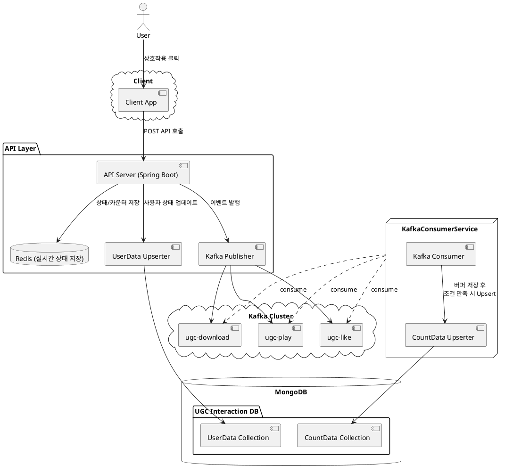

## 1. Problem Definition

대규모 동시 요청과 높은 데이터 볼륨을 가지는 사용자 행동 데이터를  
**실시간으로 처리하면서도 안정성과 정합성을 유지하는 구조**가 필요하다.

### 대상 데이터

- 좋아요 / 싫어요
- 플레이 수
- 다운로드 수

### 요구사항

- 높은 TPS에서도 빠른 응답 보장
- 데이터 유실 최소화
- 실시간 조회 성능 확보
- 장애 발생 시 복구 가능해야 함

---

## 2. Architecture 개요

### Modern Streaming Architecture

Kafka, Redis, MongoDB를 조합한 **이벤트 기반 스트리밍 구조**

#### 선택 이유

- **Write / Read 경로 분리**
- **실시간성과 정합성의 균형**
- **장애 복구 가능한 구조**
- **확장 가능한 이벤트 기반 구조**

#### Kafka: 신뢰성 있는 이벤트 전달자

- 비동기 메시징으로 빠르게 데이터를 수신하고, 느린 후속 처리(예: DB upsert)와 분리 가능
- 장애 발생 시 재처리 가능
- 토픽 기반 분리로 이벤트 유형별 파이프라인 관리에 유리

#### Redis: 캐시 및 임시 저장소

- **UserData 저장의 경우**: 실시간 조회 최적화를 위한 캐시
- **CountData 저장의 경우**: (안정성과 성능을 고려한) MongoDB에 데이터 올라가기 전, 임시 저장소 용도

#### MongoDB: 최종적인 데이터 정합성과 조회를 위한 저장소

- **UserData**: 특정 사용자가 특정 게임에 대해 좋아요/싫어요/무반응 상태인지 저장
- **CountData**: 특정 게임의 총 좋아요 수, 싫어요 수, 다운로드 수, 플레이 수 등의 집계 데이터 저장

### 전체 흐름

```
[User]
   ↓ Action (ex. Like/Dislike/Play/...)
[API 서버 (Spring Boot)]
   ├─ Redis: 실시간 카운터
   ├─ MongoDB: UserStatusData에 한해서만 즉시 Upsert
   ├─ Kafka: 이벤트 발행
   └─ 사용자에게 응답

[Kafka Consumer]
   └─ (특정 조건 만족 시) MongoDB CountData Upsert

[조회 API 응답]
   ├─ Redis 값 우선 조회
   └─ fallback 시 Mongo 조회 (TTL 또는 누락 시)

[보정 작업]
   └─ 에러 발생한 건들에 대해 보정 작업 수행
```

---

## 3. Architecture 상세

### Component Diagram

> 장애 대응용 컴포넌트는 포함하지 않음



### 처리 흐름 설명

```text
[User]
   ↓
[API 서버 (Spring Boot)]
   ├─ Redis: 실시간 카운터 및 유저 상태 저장
   │        (유형에 따라 저장/Validation 방식 다름)
   ├─ MongoDB: UserData에 한해서만 즉시 Upsert
   └─ Kafka: user-{like/play/downloads} 이벤트 발행
            {userId, ugcId, timestamp, ...}

[Kafka Topics]
   ├─ ugc-like
   ├─ ugc-play
   └─ ugc-download

[Kafka Consumer]
   └─ user-{like/play/downloads}
         └─ [CountData] 특정 조건(수량, 시간) 만족 시 MongoDB Upsert

[조회 API 응답]
   ├─ Redis 값 우선 조회
   └─ fallback 시 Mongo 조회 (TTL 또는 누락 시)

[보정 작업]
   └─ 에러 발생한 UgcId들에 대해 보정 작업 수행 (하루 1번)
```

---

## 4. Why This Architecture

### Write / Read 경로 분리 (Throughput 최적화)

사용자 요청 처리와 데이터 조회를 분리하여, 각각에 최적화된 전략 적용

- **Write 경로**
    - Redis + Kafka 기반으로 저지연 처리
    - DB 쓰기를 비동기화하여 TPS 대응력 확보
- **Read 경로**
    - Redis 캐시 기반 빠른 응답
    - 필요 시 MongoDB fallback으로 정합성 보완

→ 쓰기 성능과 조회 성능을 동시에 만족하는 구조를 구성

### 비동기 이벤트 기반 처리 (Latency vs Consistency 분리)

사용자 요청과 집계 처리를 분리하여 응답 지연 최소화

- API 서버
    - 상태 변경 (Redis / 일부 Mongo)
    - 이벤트 발행 (Kafka)
- Kafka Consumer
    - 집계 처리 (지연 / 배치 기반)

→ 사용자 응답 속도를 유지하면서, 집계 처리량은 시스템 확장으로 대응 가능하도록 설계

### 실시간성과 정합성의 균형

단일 저장소로는 충족하기 어려운 요구사항을 다층 구조로 해결

- Redis: 빠른 조회를 위한 실시간 상태
- MongoDB: 최종 정합성을 보장하는 저장소

→ "즉시 응답 값"과 "최종 정합 값"을 분리하여 관리

### 장애 대응 및 복구 가능성 (Reliability)

Kafka를 활용하여 제한된 범위 내 재처리 가능성을 확보

- Consumer 장애 시 offset 기반 재처리 가능
- 다만 Kafka는 운영 정책상 보관 기간이 제한되어 있어, 장기 로그 기반 재집계 구조는 아님
- 따라서 데이터 불일치 발생 시에는 Redis와 MongoDB 데이터를 비교하여, 복구 기준에 따라 허용 가능한 범위 내 손실을 감수하고 덮어쓰는 별도 복구 전략을 적용

→ Kafka 자체를 영구 복구 수단으로 사용하지 않고, **제한적 재처리 + 별도 보정 체계** 를 통해 안정성을 확보하는 구조
→ 단순한 고성능 시스템이 아니라, **복구 가능한 시스템(Recoverable System)** 을 목표로 설계

### 확장성 (Scalability)

각 컴포넌트를 독립적으로 확장할 수 있도록 구성

- Kafka: 파티션 기반 수평 확장
- Consumer: 인스턴스 증가로 처리량 확장
- Redis / MongoDB: 클러스터링 및 샤딩 가능

→ 트래픽 증가 시 병목 지점만 선택적으로 확장 가능

### 유지보수성과 진화 가능성 (Maintainability)

컴포넌트 간 역할을 명확히 분리하여 변경에 유연하게 대응

- 이벤트 기반 구조 → Consumer 추가로 기능 확장 가능
- 저장소 분리 → 기술 변경 영향 최소화
- 집계 로직 분리 → 정책 변경 대응 용이

→ 초기 요구사항뿐 아니라, 장기적인 확장과 변경까지 고려한 구조

---

## 핵심 요약

이 구조는 단순히 성능을 위한 설계가 아니라,

> **정합성을 포기하지 않고, 정합성의 시점을 분리한 구조**

